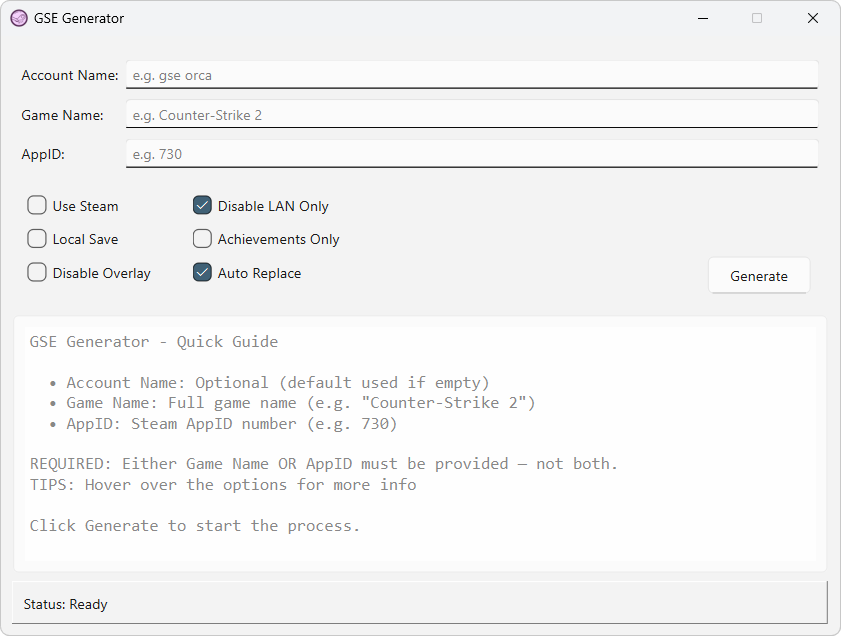
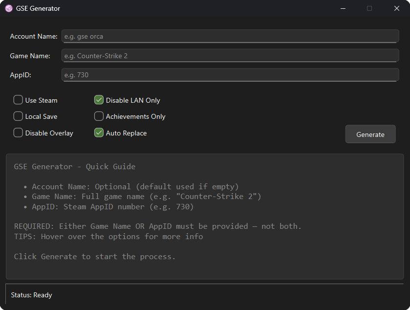

# YAGG: Yet Another GSE Generator 🎮

A Python-based GUI application for generating GSE (Goldberg Steam Emulator) configurations with achievement support for Steam games. 🏆

## 🚀 Usage

1. **Launch the application**
2. **Fill in the required fields:**
   - **Account Name:** Desired Account name (optional)
   - **Game Name** **or** **AppID:**
     - **Game Name:** Name of the game (required if AppID is not provided)
     - **AppID:** Steam Application ID of the game (required if Game Name is not provided)
3. **Select desired options:**
   - **Use Steam:** Uses Steam as source
   - **Local Save:** Enables saving in the game directory 
   - **Disable LAN Only:** Disables LAN-only mode
   - **Achievements Only:** Generates achievements only 
   - **Disable Overlay:** Disables the Steam overlay (useful if the game crashes)
4. **Click "Generate"** to create the GSE configuration
5. Follow the **file picker popup** and select the **original** **steam_api(64).dll** from game folder
6. Generated GSE (or Achievements) can be found in the same application folder

## ⚙️ Installation

### 📦 Using the Executable (.exe)

No installation required. Simply download `YAGG.zip` from the [releases](https://github.com/0xNullPointers/YAGG/releases/latest) page, extract it to a folder and run the executable.

### 🐍 Using Python Source

1. Ensure Python 3.9 or higher is installed
2. Install required packages:
```bash
pip install -r requirements.txt
```
3. Run the main script:
```bash
python main.py
```

## 📸 Screenshots

<details>
<summary><strong>☀️ Light Mode</strong></summary>

</details>

<details>
<summary><strong>🌙 Dark Mode</strong></summary>

</details>

## ⚙️ Configuration Options

- **Account Name**: Sets the account name for the GSE configuration (optional)
- **Game Name**: Specifies the game name in the configuration (or)
- **AppID**: The Steam Application ID for the game
  - Can be found in the game's Steam store URL  
  (e.g., for https://store.steampowered.com/app/730/, the AppID is 730)
- **Use Steam**: Uses Steam as source
- **Local Save**: Store the saves in Game Directory
- **Disable LAN Only**: Disables LAN-only mode in GSE
- **Achievements Only**: Skips GSE and only generates Achievements
- **Disable Overlay**: Disables the Steam overlay feature. Use if game keeps crashing

## ✨ Features

- User-friendly graphical interface
- Generate GSE configurations with achievement support
- Multiple configuration options:
  - Steam as source (Reliable)
  - Local save functionality
  - LAN-only mode
  - Achievement-only mode
  - Overlay settings

## 🛠️ Building from Source

The project uses `Nuitka` to create a standalone executable:

1. Install Nuitka and required dependencies:
```bash
pip install nuitka
pip install -r requirements.txt
```

2. Run the Python build script:
```bash
python build_script.py
```

The compiled executable will be created in the `dist` directory with all required dependencies.

## 💡 Credits

This tool uses:
- [SteamDB](https://steamdb.info/) as source
- [Steam Community](https://steamcommunity.com/) as source
- [GBE Fork](https://github.com/Detanup01/gbe_fork) for GSE
- [GSE-Generator](https://github.com/brunolee-GIT/GSE-Generator) for idea

Steam and all related properties are trademarks of Valve Corporation.

---

## 📝 Notes

- Either **Game Name** or **AppID** must be provided.
- Ensure all fields are filled accurately to avoid configuration errors.
